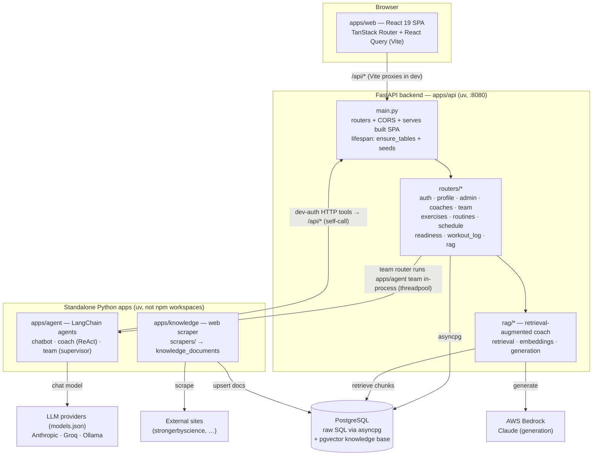
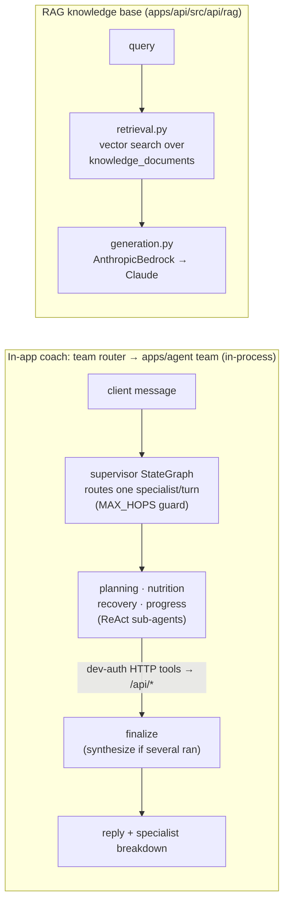
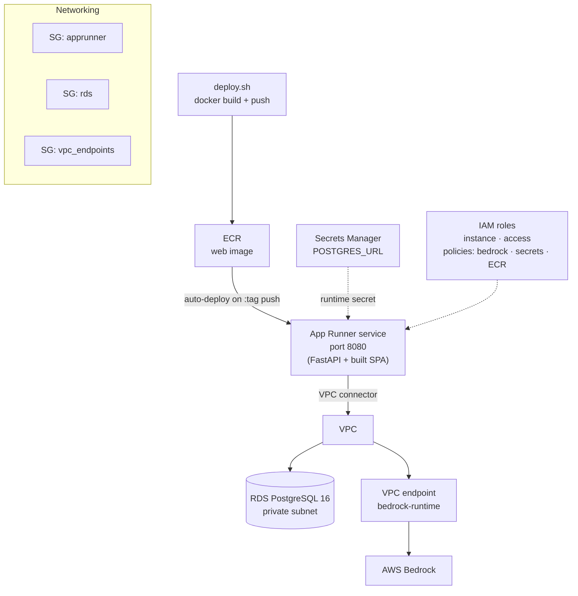

# PFA Training — Architecture

Fitness coaching platform: an admin schedules workouts and manages clients; clients
log workouts, check readiness, and chat with an AI exercise coach. The system is a
monorepo with one React SPA, one FastAPI backend (the only backend), two standalone
Python apps (LangChain agents + a knowledge scraper), and Terraform-managed AWS infra.

## System overview

## Backend routers (`apps/api/src/api/routers/`)

One file per feature, each an `APIRouter` registered in `main.py`'s `include_router`
loop. Auth via FastAPI dependencies in `auth.py` (`require_user` / `require_admin` /
`require_coach`), reading `x-user-email` (dev) or `Authorization: Bearer` (prod).

| Router | Responsibility |
|---|---|
| `auth` | Login, identity, role resolution |
| `profile` | Client profile read/write |
| `admin` | Admin-only user & content management (`/api/admin/*`) |
| `coaches` | Coach spotlights, coach-facing routes (`require_coach`) |
| `team` | Multi-agent coaching team chat (`/api/coach/team/chat`) |
| `exercises` | Exercise catalog (seeded) |
| `routines` | Workout routines (JSONB exercise arrays) |
| `schedule` | Scheduling workouts for clients |
| `readiness` | Daily readiness check-ins |
| `workout_log` | Logged workout sets/results |
| `rag` | RAG exercise-coach Q&A endpoint |

All schema lives in `ensure_tables()` (`db.py`); migrations are `ALTER TABLE … ADD
COLUMN IF NOT EXISTS`. Seed functions run from the lifespan and only insert when empty.

## AI: the coaching team and the RAG knowledge base

The **user-facing coach is the multi-agent coaching team**. A separate RAG retrieval
pipeline still exists — its `rag` endpoints remain (and back admin knowledge
management) — but the team has replaced RAG as the in-app coach.

- **Coaching team** — `apps/api` depends on `apps/agent` (uv path source); the `team`
  router runs the team's *synchronous* LangGraph in a threadpool and persists each
  turn to `rag_chat_history`. The team (`apps/agent/src/agents/team/`) is a hand-rolled
  supervisor `StateGraph` that routes each turn to one of four specialists (planning,
  nutrition, recovery, progress) — each a ReAct sub-agent — with a `MAX_HOPS` guard and
  a finalize node that synthesizes when several specialists contribute. Specialists
  reach data via `team/tools.py` (over `common/api.py`): thin HTTP wrappers that
  **self-call the FastAPI backend** as the authenticated client using **dev-auth
  headers** (`acting_user` sets `x-user-email` per request). ⚠️ This needs
  `ALLOW_DEV_AUTH_HEADERS=true` and is **not yet production-safe** — prod uses Bearer
  tokens the team doesn't hold; replace with a loopback service token or direct
  in-process data access before shipping.
- **RAG knowledge base** (`apps/api/src/api/rag/`) runs *inside* FastAPI. `retrieval.py`
  does vector search over `knowledge_documents`; `generation.py` calls Claude on **AWS
  Bedrock** via `AnthropicBedrock`. Exposed through the `rag` router.
- **Standalone agent CLIs** (`apps/agent`, model/provider chosen in `models.json` via
  `common/model.py` — **Anthropic, Bedrock, Groq, Ollama**) read real app data through
  the same dev-auth HTTP tools:
  - `team/` — the same coaching team, runnable on its own (`uv run team`).
  - `coach/` — one ReAct agent (explicit `StateGraph`: model node ⇄ `ToolNode`).
  - `chatbot/` — minimal reference chat agent (`uv run chatbot`).

## Knowledge scraper (`apps/knowledge/`)

Standalone `uv` CLI that ingests fitness content. `scrapers/` (base + per-site, e.g.
`strongerbyscience.py`) fetch articles; `db.py` `upsert_document()` writes them into
`knowledge_documents` (pgvector-indexed) for the RAG coach to retrieve. Insert is
idempotent on URL.

## Data layer

Single PostgreSQL instance, **raw SQL via `asyncpg`, no ORM**. A JSONB codec
(`_init_conn`) transparently (de)serializes JSONB. Email is the primary user
identifier throughout. Nested data (exercises in routines, media on exercises) is
JSONB; media stored as base64 data URLs. The same DB holds both the app tables and
the `knowledge_documents` RAG corpus.

## Deployment (`infra/`, Terraform → AWS)

A single container image (root `Dockerfile`) builds the SPA and serves it from
FastAPI, deployed to **AWS App Runner** (port 8080). App Runner reaches private **RDS
Postgres 16** and **Bedrock** through a VPC connector + a `bedrock-runtime` VPC
endpoint (private egress). `POSTGRES_URL` is injected from **Secrets Manager**; IAM
roles grant Bedrock, Secrets, and ECR access. Images live in **ECR** with a lifecycle
policy; pushing a new tag triggers redeploy. Because the `team` router imports the
team, **`apps/agent` is now bundled into the API image** — the `Dockerfile` copies
`apps/agent` so `uv sync` can resolve the path dependency, and the team runs in-process
in the deployed service. The knowledge scraper and the standalone agent CLIs
(`coach`, `chatbot`, `team`) remain dev/ops tools, not run by the service.

## Dev workflow

`./scripts/dev.sh` checks Postgres, runs FastAPI on `:8080`, and starts Vite (proxies
`/api` → `:8080`). Dev auth is enabled with `ALLOW_DEV_AUTH_HEADERS=true`, which seeds
the `admin`/`client`/`coach` dev accounts and accepts the `x-user-email` header.
